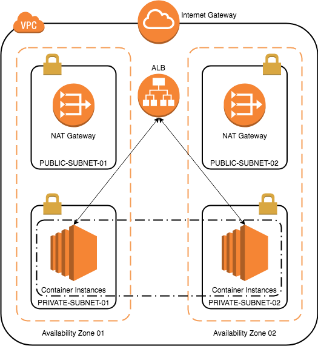

___

# Lab Setup

__This section needs much administrator access to AWS__

___

## AWS Interface Note:

In this section we will be working directly with AWS.  The exercise demonstrates the steps needed to accomplish each specific task using the AWS-CLI.  This is works well and is a consistent way to interface with AWS.  Although the same tasks can be done via the web-based AWS Console using the CLI or the API are essential skills to have when automating workflow.  __As a learning exercise feel free to login to the AWS Console and reflect also what is happing there as you work though each step.__  The AWS Console is an excellent tool to not only assist in leaning but also with day to day monitoring and troubleshooting.   But do not become reliant on just the AWS Console, as was mentioned before, that interface alone does not help with automation.  Automation is an essential requirement for DevOps, Pipelining and of course Microservices.

___

In this activity we will deploy the CloudFormation template to setup the Lab environment and configure Cognito User Pool.

# Deploy and manage Microservices on ECS and Fargate

In this workshop we will deploy a microservices based Contacts Management application on Amazon Elastic Container Service (ECS). We will also a build a CodePipeline for one of the microservices to establish CI/CD Pipeline.

___

## Application Overview


___

# Lab Setup

In this activity we will deploy the CloudFormation template to setup the Lab environment and configure Cognito User Pool.

First let's change to the correct working directory.

~~~shell
cd ~/microservices-bootcamp/exercise/aws/source/fargate/microservice
~~~
___

## Task 1 - Deploy the CloudFormation Template

~~~shell
# Create CloudFormation Stack
aws cloudformation create-stack \
--stack-name ecs-workshop-${LAB_NUMBER} \
--template-body file://cfn-templates/lab-setup-template.yaml \
--capabilities CAPABILITY_IAM CAPABILITY_NAMED_IAM \
--parameters \
ParameterKey="SshKeyName",ParameterValue="Default"

# Verify that stack creation is complete
aws cloudformation wait stack-create-complete \
--stack-name ecs-workshop-${LAB_NUMBER}
~~~

**Note** - The CloudFormation stack will try to create a DynamoDB Table named **sessions**. If you already have a DynamoDB table named **sessions** either delete the table or use another AWS Region.

The CloudFormation will create a VPC as illustrated below. The Container Instances will be deployed later in the Workshop.

### Network Layout



Once the CloudFomration stack creation is complete, note the stack Output parameters. You can also query Stack output using the below command.

```bash
aws cloudformation describe-stacks --stack-name ecs-workshop --query Stacks[*].Outputs
```

Click [here](https://console.aws.amazon.com/cloud9/home) Cloud9 console and open the ECS-Workshop IDE created by the above ecs-workshop CloudFormation stack. We will continue to execute the remainder of the workshop from the Cloud9 IDE terminal.

___

## Task 2 - Configuring the Cognito User Pool

The ecs-workshop CloudFormtion stack created a Cognito User-Pool and a Cognito App client. We will now configure the address of your sign-up and sign-in webpages using the hosted Amazon Cognito domain with your own domain prefix.

1. Create a Cognito User-Pool domain.

```bash
# <SOME-UNIQUE-ID> - e.g. your AWS-Account-Id [or] email-alias, etc.
#  <CognitoUserPoolId> - Refer to ecs-workshop CloudFormation stack output

aws cognito-idp create-user-pool-domain \
--domain <SOME-UNIQUE-ID> \
--user-pool-id <CognitoUserPoolId>
```

2. Change the Cognito Email verification type from **Code** to **Link**.

```bash
#  <CognitoUserPoolId> - Refer to ecs-workshop CloudFormation stack output

aws cognito-idp update-user-pool --user-pool-id <CognitoUserPoolId> \
--auto-verified-attributes "email" \
--verification-message-template \
"{
    \"EmailMessageByLink\": \"Please click the link below to verify your email address. {##Verify Email##}\",
    \"EmailSubjectByLink\": \"Your verification link\",
    \"DefaultEmailOption\": \"CONFIRM_WITH_LINK\"
}"
```

___
